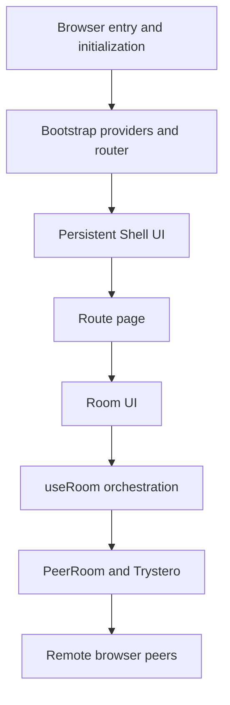

# Chitchatter architecture diagrams

This directory explains how the Chitchatter UI is assembled and how the runtime code connects browser state, React contexts, peer-to-peer communication, media, and file transfer.

The diagrams were produced from:

- source commit `c61fe6fefdd5c00db963ce20aad096d04422583d`;
- a local offline Graphify graph in `graphify-out/graph.json` (`720` nodes and `1687` edges; SHA-256 `196252b6a7846999dcef6594cd4fecb522c99c5ac60224b37a1831f171697127`);
- `nix-config` flake commit `f4c0db2585f99b6ac729c3463c632f4490bab3df`;
- Graphify source commit `75922443866244d4bb6a266b8e085aa82b10dbe7` with Nix hash `sha256-X2cgjPSNBD3F91x9VcQ0PGL7cOGHhniSdtUz+1kKakI=`;
- targeted Graphify queries for the startup, shell, room, and `PeerRoom` subgraphs;
- source verification against the files linked in each document;
- the supplied DeepWiki export, used as supporting context rather than as the source of truth.

## Reproducing the Graphify analysis

`graphify-out/` is a local generated artifact and is not committed to this branch. To reproduce the graph at the documented source revision, check out the commit above and run from the repository root:

```bash
nix run github:drunkod/nix-config-1/f4c0db2585f99b6ac729c3463c632f4490bab3df#graphify-extract -- .
nix run github:drunkod/nix-config-1/f4c0db2585f99b6ac729c3463c632f4490bab3df#graphify-query -- "Bootstrap Shell RouteContent Home PublicRoom PrivateRoom Room" --graph ./graphify-out/graph.json
nix run github:drunkod/nix-config-1/f4c0db2585f99b6ac729c3463c632f4490bab3df#graphify-query -- "PeerRoom useRoom RoomContext useRoomAudio useRoomVideo useRoomScreenShare useRoomFileShare" --graph ./graphify-out/graph.json
shasum -a 256 ./graphify-out/graph.json
```

The revision-pinned public flake locks the wrapper and Graphify source through its `flake.lock`. A healthy code-only extraction should report `0 docs, 0 papers, 0 images`, and the final checksum should match the value above.

## Documents

1. [UI architecture](ui-architecture.md)
   - startup and route selection;
   - shell layout;
   - home-to-room navigation;
   - room controls, video, chat, and responsive layout.
2. [Codebase and runtime architecture](codebase-runtime.md)
   - major code layers;
   - context ownership;
   - room creation and peer lifecycle;
   - messages, media streams, and file transfer;
   - private-room identity and password handling.

## Reading order



For a UI-oriented introduction, start with [UI architecture](ui-architecture.md). For implementation and network behavior, continue with [Codebase and runtime architecture](codebase-runtime.md).
