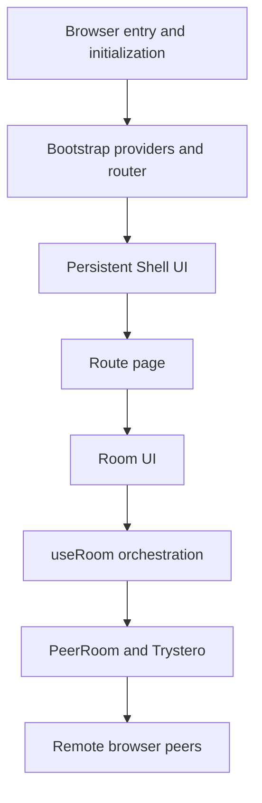

# Chitchatter architecture diagrams

This directory explains how the Chitchatter UI is assembled and how the runtime code connects browser state, React contexts, peer-to-peer communication, media, and file transfer.

The diagrams were produced from:

- the local offline Graphify graph in `graphify-out/graph.json` (`720` nodes and `1687` edges at the time of analysis);
- targeted Graphify queries for the startup, shell, room, and `PeerRoom` subgraphs;
- source verification against the files linked in each document;
- the supplied DeepWiki export, used as supporting context rather than as the source of truth.

## Documents

1. [UI architecture](ui-architecture.md)
   - startup and route selection;
   - shell layout;
   - home-to-room navigation;
   - room controls, video, chat, and responsive layout.
2. [Codebase and runtime architecture](codebase-runtime.md)
   - major code layers;
   - context ownership;
   - room creation and peer lifecycle;
   - messages, media streams, and file transfer;
   - private-room identity and password handling.

## Reading order

For a UI-oriented introduction, start with [UI architecture](ui-architecture.md). For implementation and network behavior, continue with [Codebase and runtime architecture](codebase-runtime.md).
