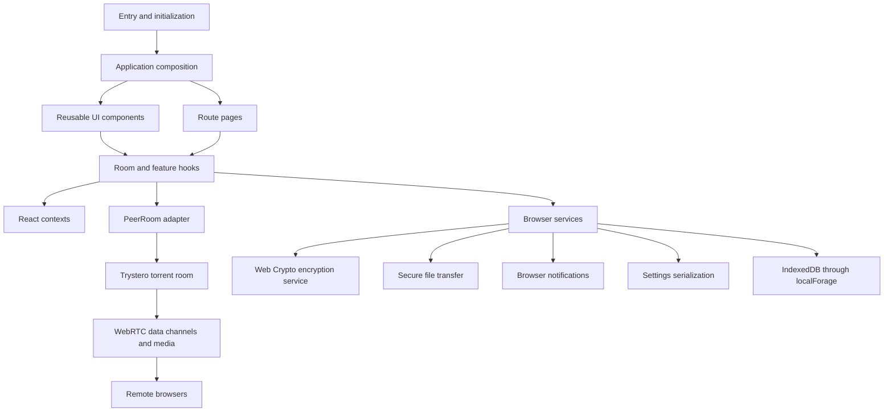
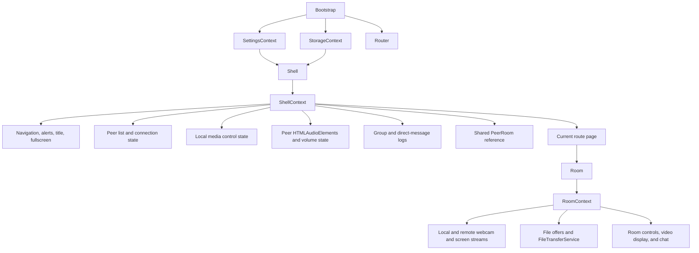
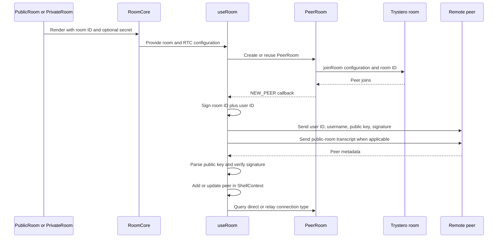
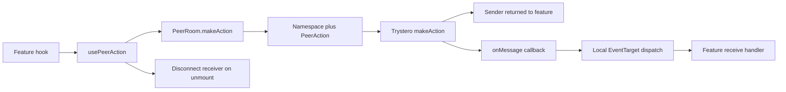
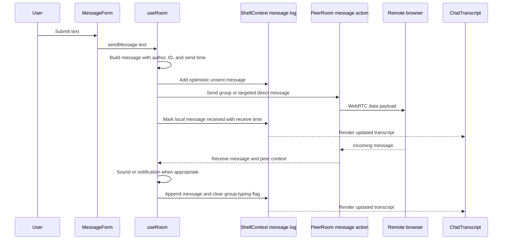
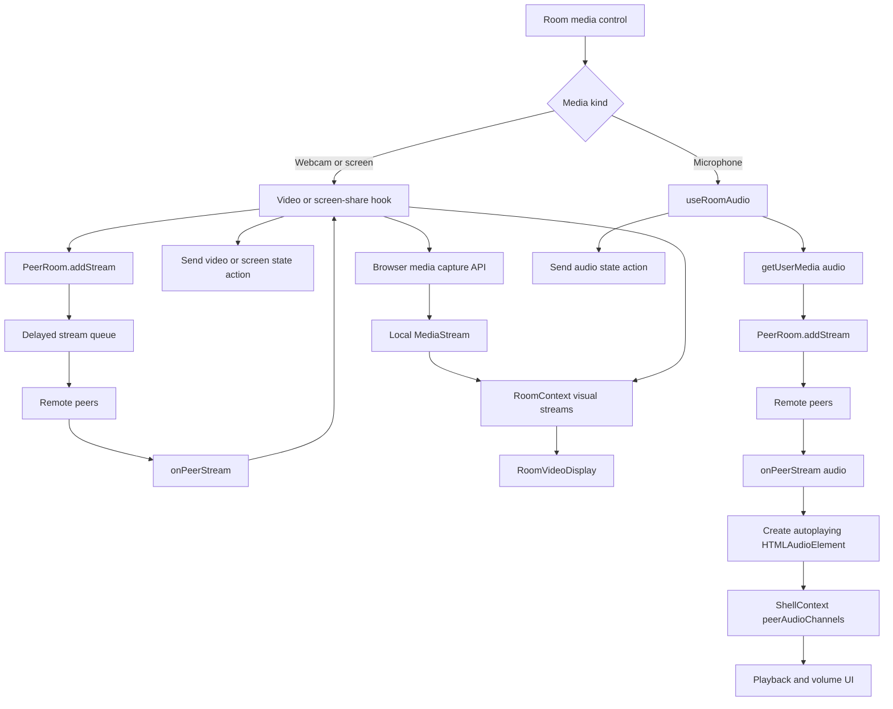
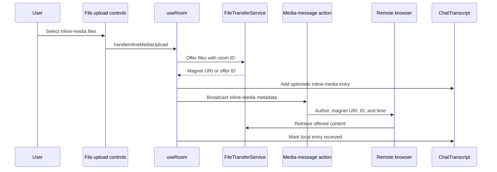
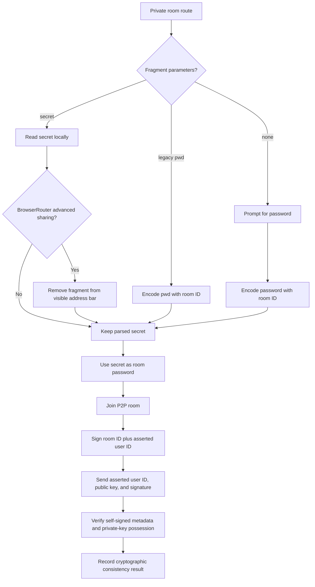
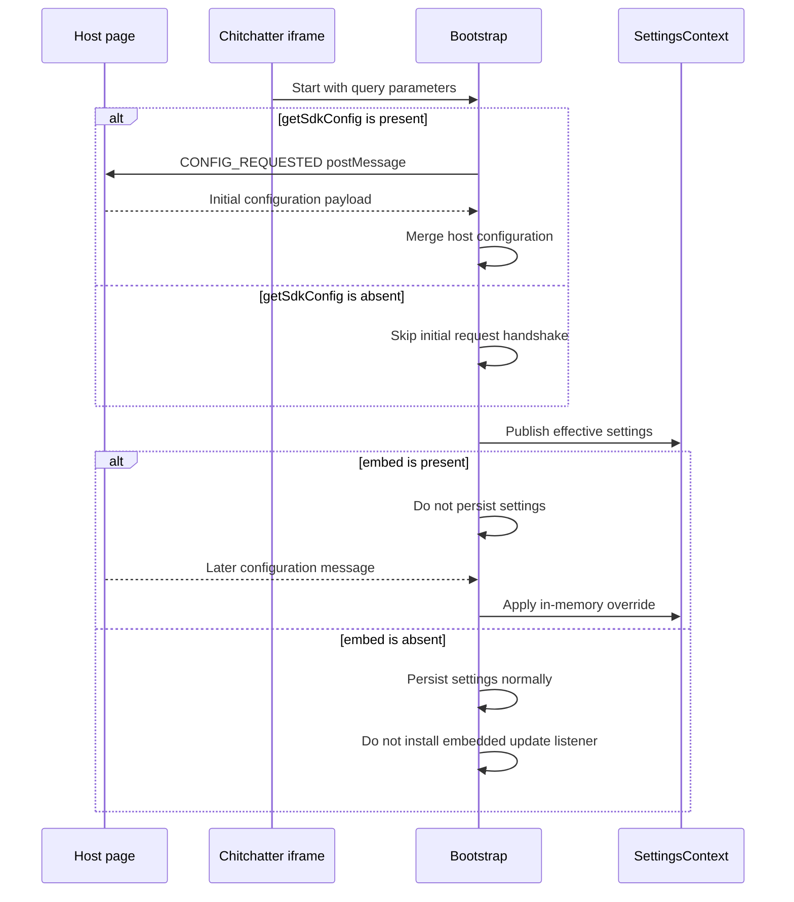

# Codebase and runtime architecture

This document describes the major implementation layers and the flows connecting React, local browser services, Trystero/WebRTC, and remote peers.

## 1. Major code layers

Graphify identifies the UI shell, room component, room hooks, and `PeerRoom` as the central application subgraph. The source is organized as layered modules rather than a separate backend-driven chat architecture.

### Directory roles

| Area | Responsibility |
| --- | --- |
| `src/pages/` | Route-level screens and route parameter handling |
| `src/components/Shell/` | Persistent app frame, global room state, navigation, peer list, dialogs |
| `src/components/Room/` | Room presentation and feature-specific media/file hooks |
| `src/hooks/` | Shared React integration such as peer actions and throttled mounting |
| `src/lib/PeerRoom/` | Adapter around Trystero room actions, events, peers, and streams |
| `src/services/` | Encryption, serialization, notification, settings, and file transfer |
| `src/contexts/` | State contracts shared across shell, settings, storage, and room UI |
| `src/models/` | Chat, network, settings, routing, storage, and SDK types |
| `sdk/` | Embedding SDK/web-component integration |
| `api/` | Runtime configuration endpoint |

## 2. State ownership and context boundaries

`ShellContext` has a wider lifetime than `RoomContext`. This allows shell-level peer and message state—especially direct-message logs—to remain available while route content changes. `RoomContext` is scoped to the mounted room and exposes state needed by room controls and displays.

## 3. Room creation and peer lifecycle

A `PeerRoom` instance wraps the underlying Trystero room. It multiplexes multiple join, leave, and stream handlers, caches named actions, and reports whether each WebRTC connection selected a direct or relay candidate.

On group-room unmount, `useRoom` leaves the room, flushes handlers, clears the peer reference, resets the peer list, and clears the group message log. Direct-message views reuse the active room instead of leaving it.

## 4. Peer action abstraction

Features communicate through named actions. `usePeerAction` connects a React lifecycle to a cached `PeerRoom.makeAction` result.

Group actions use the `g` namespace. Direct-message actions use `dm` and are sent with a target peer ID.

## 5. Text-message flow

The shell stores separate group and per-peer direct-message logs. Transcript size is bounded; evicted inline-media offers are rescinded when still active.

The receive handler currently clears only `isTypingGroupMessage`, even for the direct-message namespace. It does not clear `isTypingDirectMessage`. This diagram documents that current behavior; it should not be interpreted as namespace-aware typing cleanup.

## 6. Audio, video, and screen-share flow

`PeerRoom` serializes all stream additions with a delay. This prevents stream and metadata races on receiving peers. Webcam and screen-share streams pass through `RoomContext` and control `RoomVideoDisplay`. Incoming microphone streams do not enter `RoomContext`; `useRoomAudio` converts them directly to autoplaying `HTMLAudioElement` instances and stores them in `ShellContext.peerAudioChannels`.

## 7. Inline media and file transfer

Inline media uses two coordinated channels: a peer action announces the magnet URI in the chat transcript, while `secure-file-transfer` handles the actual file offer and transfer.

`FileTransferService` configures `secure-file-transfer` with the same tracker list and current RTC configuration used by the room's connectivity layer.

## 8. Private-room security flow

The user's key pair is created in the browser. Each peer supplies an asserted user ID, its public key, and a signature produced by the corresponding private key over the room/user string. A successful check proves possession of that private key and detects inconsistency or tampering in the signed metadata. It does **not** authenticate a real-world identity or prove that the asserted user ID belongs to a previously known person: this flow has no certificate authority, pinned key, trust-on-first-use record, or out-of-band fingerprint comparison. The implementation's `VERIFIED` and `UNVERIFIED` labels should therefore be understood as cryptographic consistency states, not identity trust decisions.

Fragment clearing is also conditional: `allowAdvancedRoomLinkSharing` is enabled only for `BrowserRouter`. A legacy `pwd` fragment parameter is accepted and encoded with the room ID automatically.

## 9. Embedded SDK configuration

`getSdkConfig` and `embed` are independent flags. `getSdkConfig` alone triggers the initial `CONFIG_REQUESTED` handshake. `embed` suppresses persistence and enables the listener for subsequent configuration messages. Merely embedding the iframe does not initiate the request handshake unless `getSdkConfig` is also present.

## Source anchors

- `src/Bootstrap.tsx`
- `src/components/Shell/Shell.tsx`
- `src/contexts/ShellContext.ts`
- `src/components/Room/Room.tsx`
- `src/components/Room/useRoom.ts`
- `src/hooks/usePeerAction.ts`
- `src/lib/PeerRoom/PeerRoom.ts`
- `src/services/FileTransfer/FileTransfer.ts`
- `src/pages/PublicRoom/PublicRoom.tsx`
- `src/pages/PrivateRoom/PrivateRoom.tsx`
