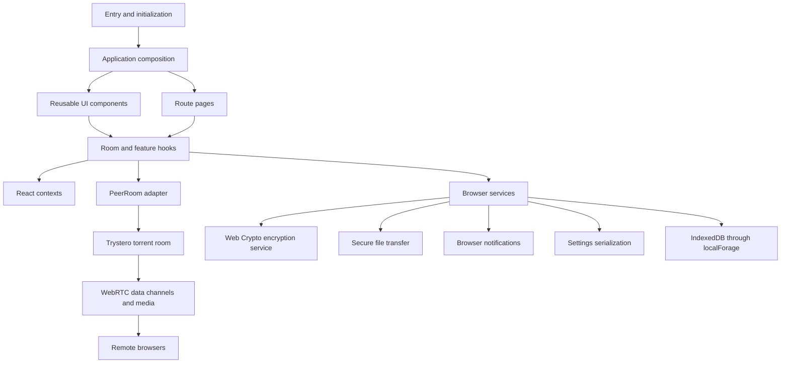
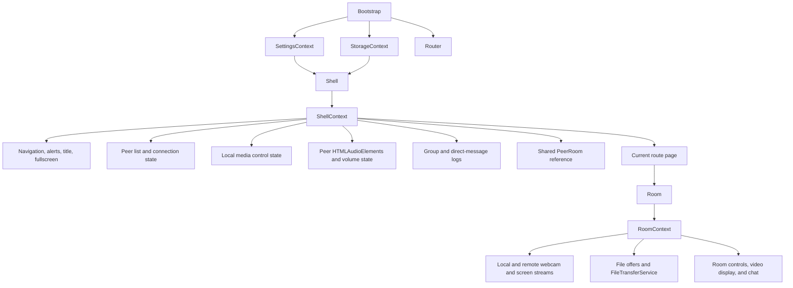
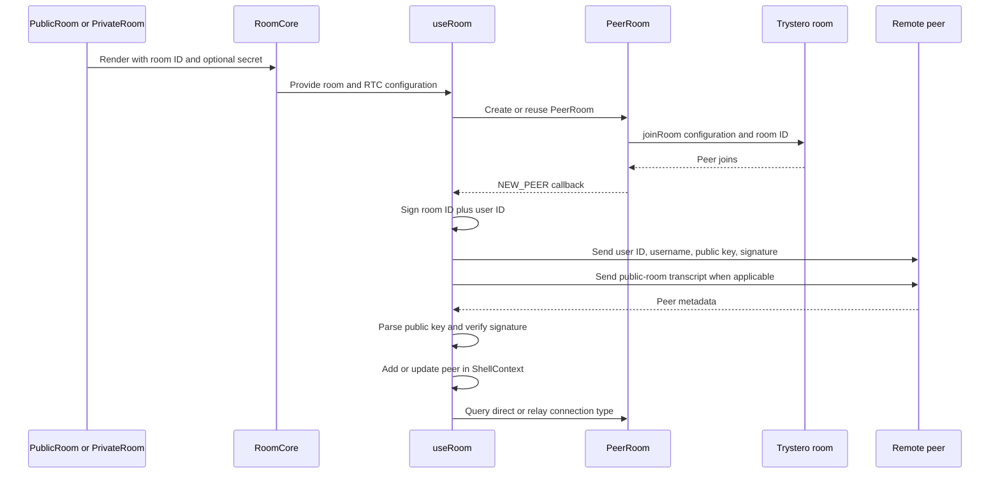
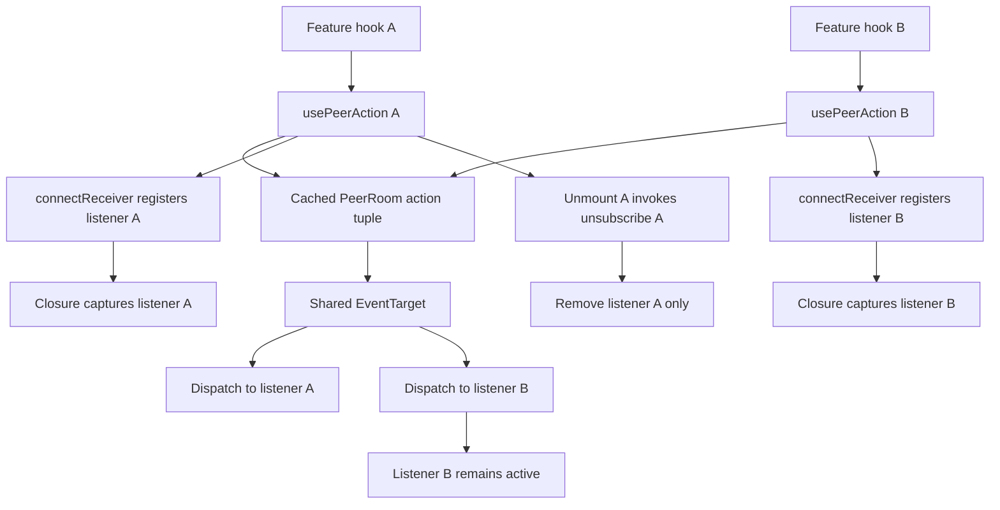
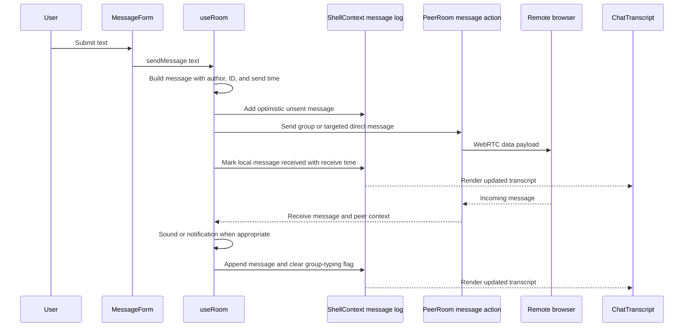
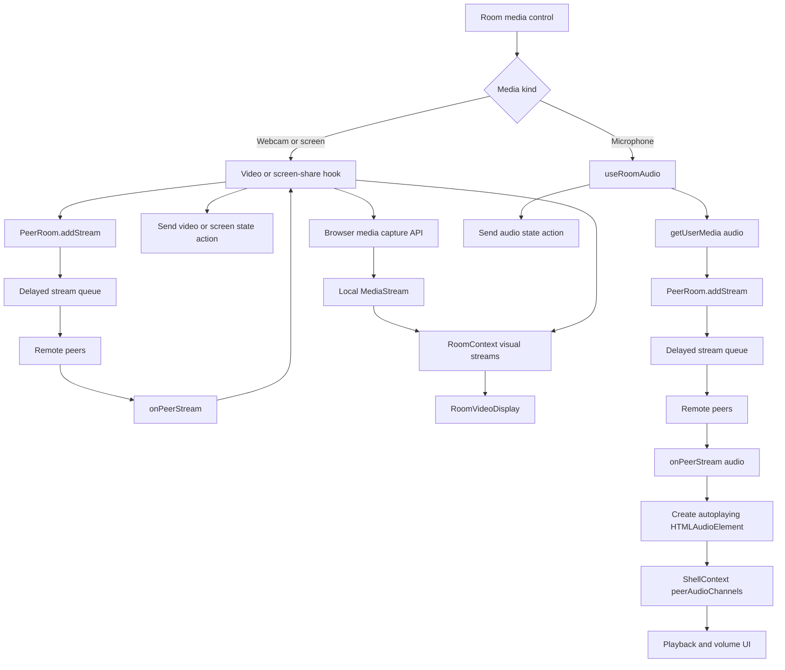
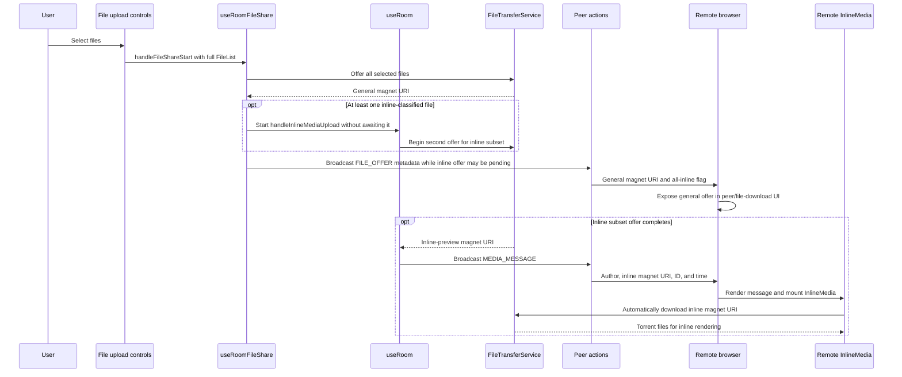
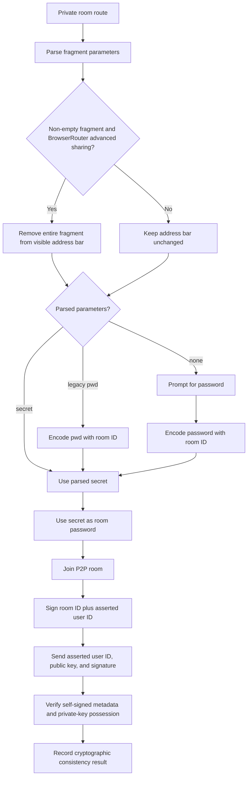
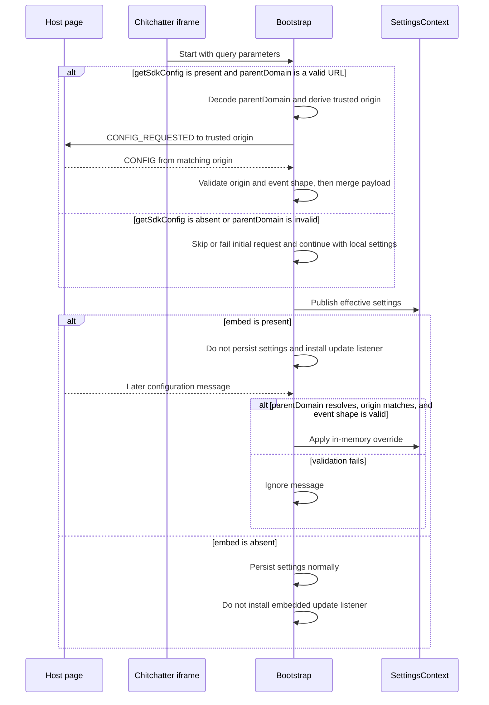

# Codebase and runtime architecture

This document describes the major implementation layers and the flows connecting React, local browser services, Trystero/WebRTC, and remote peers.

## 1. Major code layers

Graphify identifies the UI shell, room component, room hooks, and `PeerRoom` as the central application subgraph. The source is organized as layered modules rather than a separate backend-driven chat architecture.

### Directory roles

| Area | Responsibility |
| --- | --- |
| `src/pages/` | Route-level screens and route parameter handling |
| `src/components/Shell/` | Persistent app frame, global room state, navigation, peer list, dialogs |
| `src/components/Room/` | Room presentation and feature-specific media/file hooks |
| `src/hooks/` | Shared React integration such as peer actions and throttled mounting |
| `src/lib/PeerRoom/` | Adapter around Trystero room actions, events, peers, and streams |
| `src/services/` | Encryption, serialization, notification, settings, and file transfer |
| `src/contexts/` | State contracts shared across shell, settings, storage, and room UI |
| `src/models/` | Chat, network, settings, routing, storage, and SDK types |
| `sdk/` | Embedding SDK/web-component integration |
| `api/` | Runtime configuration endpoint |

## 2. State ownership and context boundaries

`ShellContext` has a wider lifetime than `RoomContext`. This allows shell-level peer and message state—especially direct-message logs—to remain available while route content changes. `RoomContext` is scoped to the mounted room and exposes state needed by room controls and displays.

## 3. Room creation and peer lifecycle

A `PeerRoom` instance wraps the underlying Trystero room. It multiplexes multiple join, leave, and stream handlers, caches named actions, and reports whether each WebRTC connection selected a direct or relay candidate.

Public group rooms key `Room` by `roomId`; private group rooms key it by `roomId` plus the derived secret. Changing connection identity therefore unmounts the old room before mounting a new transport, even if throttle state updates are batched. On group-room unmount, `useRoom` leaves the room, flushes handlers, clears the peer reference, resets the peer list, and clears the group message log. Direct-message views reuse the active group-room transport instead of leaving it.

## 4. Peer action abstraction

Features communicate through named actions. `usePeerAction` connects a React lifecycle to a cached `PeerRoom.makeAction` result, while each receiver registration gets its own unsubscribe closure.

Group actions use the `g` namespace. Direct-message actions use `dm` and are sent with a target peer ID. Incoming direct-message text and inline-media handlers also reject payloads whose sender does not match the room's `targetPeerId`. `PeerRoom.makeAction` still caches the transport action, but `connectReceiver` returns a closure over the exact listener it registered, so multiple `keepMounted` direct-message rooms can subscribe and clean up independently.

## 5. Text-message flow

The shell stores separate group and per-peer direct-message logs. Transcript updates use functional state updates so messages arriving while a send is awaiting network completion are preserved. Optimistic local entries are replaced by ID when their send completes rather than rebuilding the transcript from a captured array. If a text or inline-media action rejects, the optimistic entry is removed, an error alert is shown, and sending controls are re-enabled in `finally`. Transcript size is bounded; evicted inline-media offers are rescinded when still active.

The receive handler currently clears only `isTypingGroupMessage`, even for the direct-message namespace. It does not clear `isTypingDirectMessage`. This diagram documents that current behavior; it should not be interpreted as namespace-aware typing cleanup.

## 6. Audio, video, and screen-share flow

`PeerRoom` serializes all stream additions with a delay. This prevents stream and metadata races on receiving peers. Webcam and screen-share streams pass through `RoomContext` and control `RoomVideoDisplay`. Incoming microphone streams do not enter `RoomContext`; `useRoomAudio` converts them directly to autoplaying `HTMLAudioElement` instances and stores them in `ShellContext.peerAudioChannels`.

## 7. Inline media and file transfer

File selection creates a general file offer for the full `FileList`. If any files are inline-classified by MIME top-level type (`image`, `audio`, or `video`), it also starts a second offer for that subset. Inline classification is broader than preview support: the renderer currently supports selected image and audio filename extensions, while video files are classified for inline delivery but render “Media preview not supported.” The two offers have different peer-action metadata and receiving UI paths.

After the general offer resolves, `useRoomFileShare` starts `handleInlineMediaUpload` first and does not await its promise. It then broadcasts the general `FILE_OFFER`, so the inline subset offer may overlap the metadata broadcast. When that second offer eventually resolves, `MEDIA_MESSAGE` advertises its magnet URI in the chat transcript. On the receiving side, mounting `InlineMedia` automatically invokes `fileTransfer.download`; no explicit user retrieval step is required for the inline delivery, although unsupported extensions display a fallback instead of a preview.

Received general-offer metadata is merged into the peer-keyed record rather than replacing other peers' entries. Rescinding an offer removes only that peer's entry and safely handles an already-absent entry. `FileTransferService` configures `secure-file-transfer` with the same tracker list and current RTC configuration used by the room's connectivity layer.

## 8. Private-room security flow

The user's key pair is created in the browser. Each peer supplies an asserted user ID, its public key, and a signature produced by the corresponding private key over the room/user string. A successful check proves possession of that private key and detects inconsistency or tampering in the signed metadata. It does **not** authenticate a real-world identity or prove that the asserted user ID belongs to a previously known person: this flow has no certificate authority, pinned key, trust-on-first-use record, or out-of-band fingerprint comparison. The implementation's `VERIFIED` and `UNVERIFIED` labels should therefore be understood as cryptographic consistency states, not identity trust decisions.

Fragment parameters are snapshotted inside an effect keyed by `roomId` before the visible hash is cleared. Clearing the address bar therefore cannot retrigger the effect and erase the newly loaded secret. Changing rooms clears the previous secret immediately, and stale asynchronous derivations cannot update the new room. If advanced sharing is enabled for `BrowserRouter`, every non-empty fragment is removed before the snapshotted `secret` or legacy `pwd` branch is processed. A legacy `pwd` value is encoded with the room ID automatically.

## 9. Embedded SDK configuration

`getSdkConfig` and `embed` are independent flags. `getSdkConfig` selects the initial handshake path, but a present, valid `parentDomain` is also required: it supplies the target origin for `postMessage` and the trusted origin used to validate replies. Incoming configuration is accepted only when `parentDomain` can be resolved, `event.origin` matches it, and the event has the expected configuration shape. `embed` suppresses persistence and enables the listener for subsequent configuration messages; those messages are subject to the same origin and shape validation. Merely embedding the iframe does not initiate the request handshake unless `getSdkConfig` is present and `parentDomain` is valid.

## Source anchors

- [`src/Bootstrap.tsx`](../../src/Bootstrap.tsx)
- [`src/components/Shell/Shell.tsx`](../../src/components/Shell/Shell.tsx)
- [`src/components/Shell/PeerListItem.tsx`](../../src/components/Shell/PeerListItem.tsx)
- [`src/contexts/ShellContext.ts`](../../src/contexts/ShellContext.ts)
- [`src/components/Room/Room.tsx`](../../src/components/Room/Room.tsx)
- [`src/components/Room/useRoom.ts`](../../src/components/Room/useRoom.ts)
- [`src/components/Room/useRoomFileShare.ts`](../../src/components/Room/useRoomFileShare.ts)
- [`src/components/Message/InlineMedia.tsx`](../../src/components/Message/InlineMedia.tsx)
- [`src/hooks/usePeerAction.ts`](../../src/hooks/usePeerAction.ts)
- [`src/lib/PeerRoom/PeerRoom.ts`](../../src/lib/PeerRoom/PeerRoom.ts)
- [`src/services/FileTransfer/FileTransfer.ts`](../../src/services/FileTransfer/FileTransfer.ts)
- [`src/pages/PublicRoom/PublicRoom.tsx`](../../src/pages/PublicRoom/PublicRoom.tsx)
- [`src/pages/PrivateRoom/PrivateRoom.tsx`](../../src/pages/PrivateRoom/PrivateRoom.tsx)
