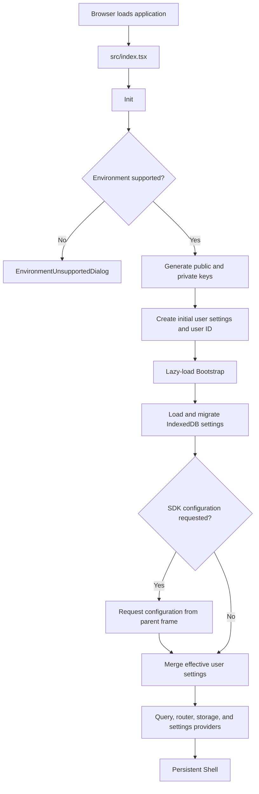
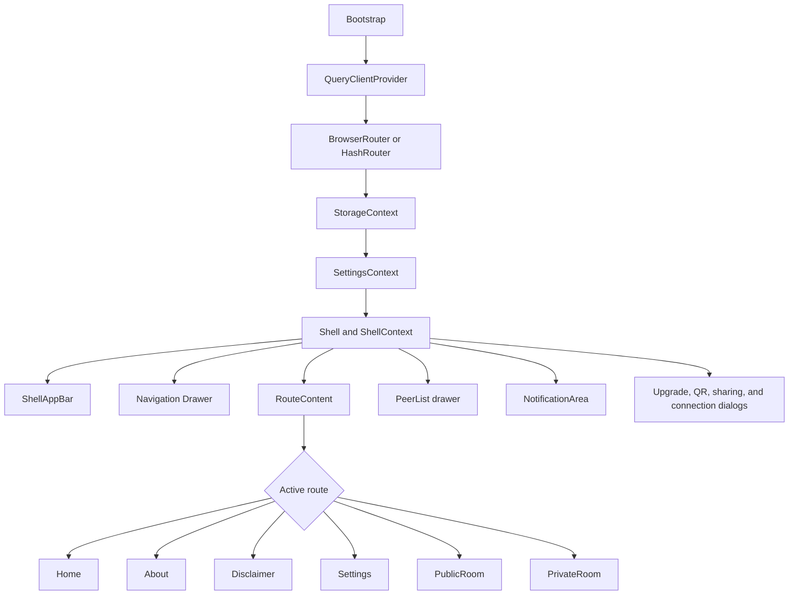
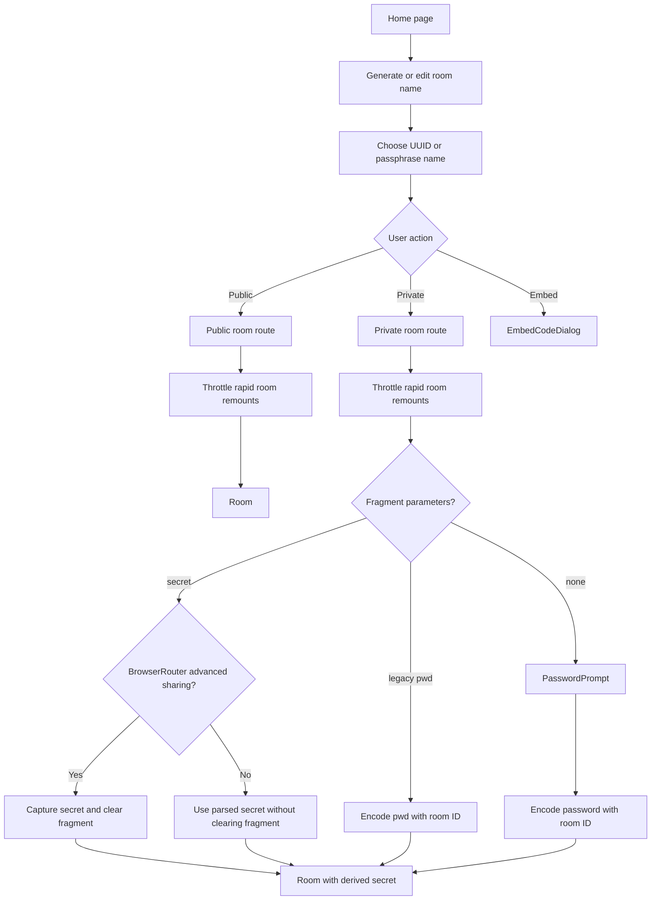
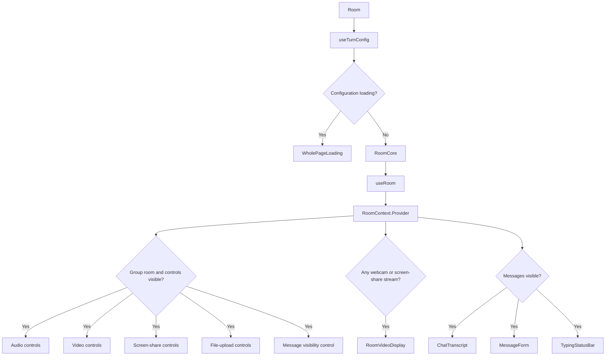
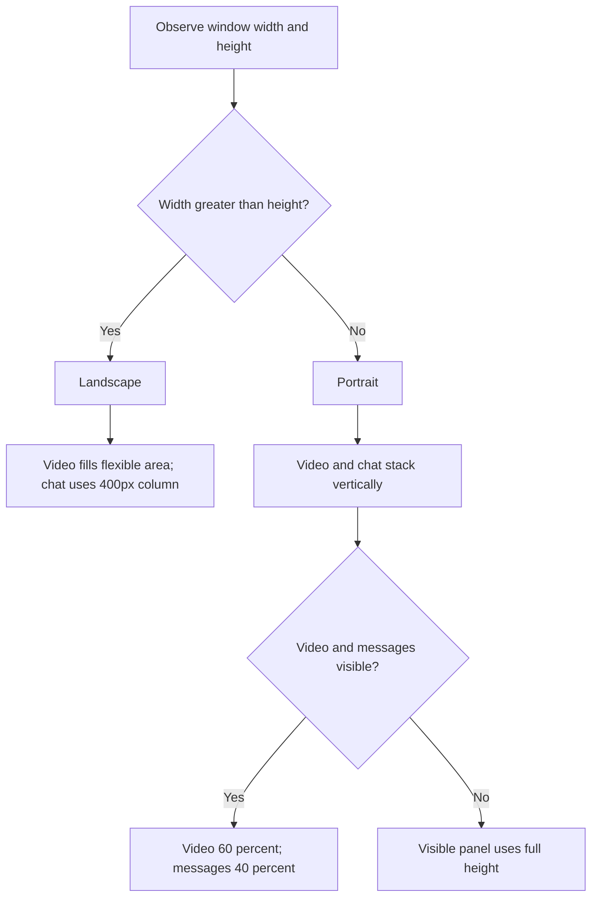

# UI architecture

This document explains how the visible application is created, how routes are placed inside the persistent shell, and how a room switches between chat and media layouts.

## 1. Browser startup and UI initialization

`src/index.tsx` mounts `Init`. `Init` checks browser support, creates the user's cryptographic key pair and initial settings, and lazy-loads `Bootstrap`. `Bootstrap` merges initial, persisted, and optional SDK-provided settings before rendering the app.

While keys or settings are loading, the UI displays `WholePageLoading`. Embedded mode can override settings through `window.postMessage`; embedded settings are not persisted by `Bootstrap`.

## 2. Route and shell composition

`Bootstrap` owns route selection, while `Shell` owns the persistent chrome around every route. This separation lets pages focus on page content while the shell retains peer state, alerts, navigation, dialogs, and responsive sidebar state.

### Shell responsibilities

- `ShellAppBar` toggles navigation, peer list, room controls, sharing, and fullscreen behavior.
- `Drawer` provides primary navigation and is omitted in embedded mode.
- `RouteContent` adjusts its left and right margins as the persistent drawers open or close.
- `PeerList` shows local and remote peer state, connection type, and audio information.
- `ShellContext` keeps shell and room state alive while route content changes.
- On large screens, sidebars default to open; smaller screens default to a content-first layout.

## 3. Home-to-room navigation

The home page generates or accepts a room name and directs the user to a public or private room route. It also exposes embed-code and enhanced-connectivity controls.

Private-room secrets may arrive in the URL fragment. Fragment clearing is conditional on `allowAdvancedRoomLinkSharing`, which is enabled only with `BrowserRouter`; hash-routed builds do not use that advanced sharing behavior. The page also accepts a legacy `pwd` fragment parameter and encodes it with the room ID automatically. If neither `secret` nor legacy `pwd` supplies a usable secret, the UI prompts for a password and derives the room secret locally.

## 4. Room UI composition

`Room` first fetches TURN configuration when enhanced connectivity is enabled. `RoomCore` then calls `useRoom`, provides `RoomContext`, and renders controls and content based on current room state.

Direct-message rooms suppress the group-room media control strip. Webcam and screen-share streams are stored in `RoomContext` and determine whether `RoomVideoDisplay` appears. Microphone audio follows a separate path: incoming streams become autoplaying `HTMLAudioElement` instances stored in `ShellContext.peerAudioChannels`, where the peer and volume UI can manage them. Direct-message actions use a separate namespace and target a specific peer.

## 5. Responsive room layout

When no webcam or screen-share streams exist, messages are forced visible so the room cannot become an empty screen. Microphone-only audio does not cause `RoomVideoDisplay` to appear.

## Source anchors

- `src/index.tsx`
- `src/Init.tsx`
- `src/Bootstrap.tsx`
- `src/components/Shell/Shell.tsx`
- `src/components/Shell/RouteContent.tsx`
- `src/pages/Home/Home.tsx`
- `src/pages/PublicRoom/PublicRoom.tsx`
- `src/pages/PrivateRoom/PrivateRoom.tsx`
- `src/components/Room/Room.tsx`
