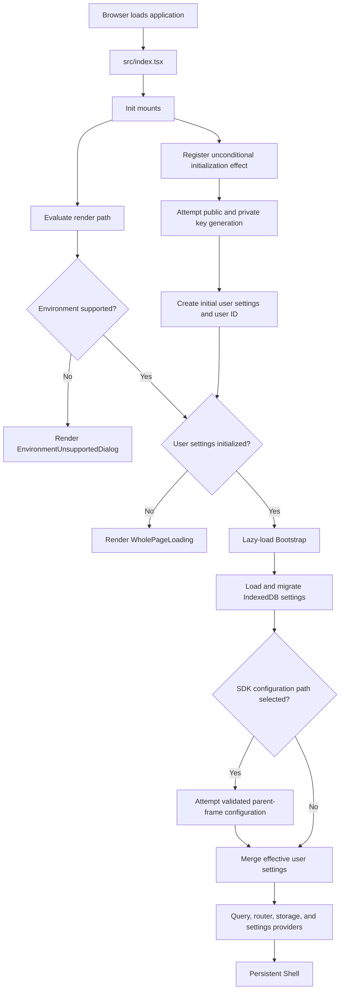
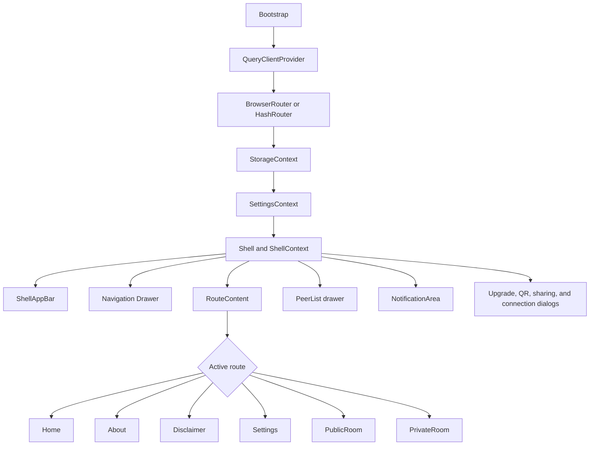
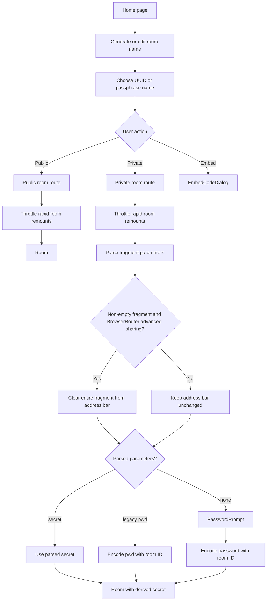
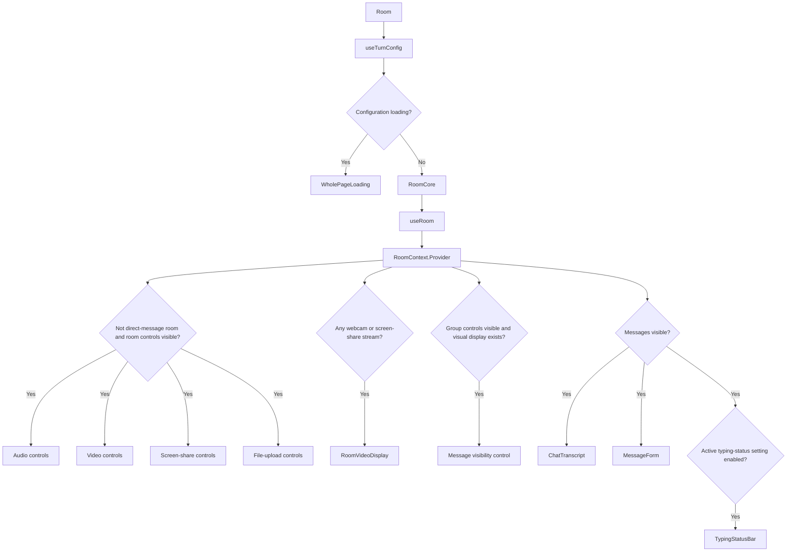
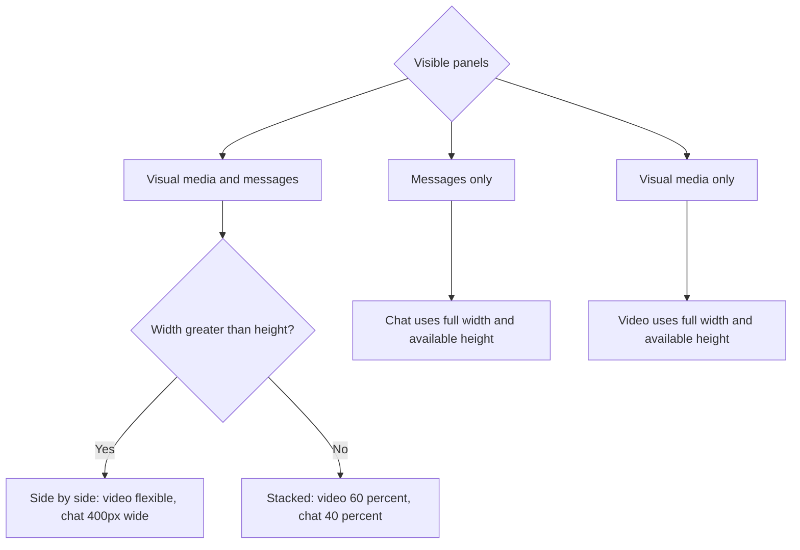

# UI architecture

This document explains how the visible application is created, how routes are placed inside the persistent shell, and how a room switches between chat and media layouts.

## 1. Browser startup and UI initialization

[`src/index.tsx`](../../src/index.tsx) mounts `Init`. On mount, `Init` both registers an unconditional key-generation effect and evaluates browser support during rendering. The support check controls what is rendered; it does not prevent the effect from attempting key generation. Once supported rendering and initialized settings are both available, `Init` lazy-loads `Bootstrap`. `Bootstrap` merges initial, persisted, and optional SDK-provided settings before rendering the app.

An unsupported environment can therefore render `EnvironmentUnsupportedDialog` while the mounted effect still attempts key generation. While a supported environment waits for keys or settings, the UI displays `WholePageLoading`. Embedded mode can override settings through validated `window.postMessage` events; embedded settings are not persisted by `Bootstrap`.

## 2. Route and shell composition

`Bootstrap` owns route selection, while `Shell` owns the persistent chrome around every route. This separation lets pages focus on page content while the shell retains peer state, alerts, navigation, dialogs, and responsive sidebar state.

### Shell responsibilities

- `ShellAppBar` toggles navigation, peer list, room controls, sharing, and fullscreen behavior.
- `Drawer` provides primary navigation and is omitted in embedded mode.
- `RouteContent` adjusts its left and right margins as the persistent drawers open or close.
- `PeerList` shows local and remote peer state, connection type, and audio information.
- `ShellContext` keeps shell and room state alive while route content changes.
- On large screens, sidebars default to open; smaller screens default to a content-first layout.

## 3. Home-to-room navigation

The home page generates or accepts a room name and directs the user to a public or private room route. It also exposes embed-code and enhanced-connectivity controls.

Private-room parameters are parsed from the URL fragment first. If the fragment is non-empty and `allowAdvancedRoomLinkSharing` is enabled—which occurs only with `BrowserRouter`—the entire fragment is cleared before either `secret` or legacy `pwd` is processed. Hash-routed builds do not use that clearing behavior. A legacy `pwd` value is encoded with the room ID automatically. If neither parameter supplies a usable secret, the UI prompts for a password and derives the room secret locally.

## 4. Room UI composition

`Room` first fetches TURN configuration when enhanced connectivity is enabled. `RoomCore` then calls `useRoom`, provides `RoomContext`, and renders controls and content based on current room state.

Direct-message rooms suppress the group-room media control strip. Webcam and screen-share streams are stored in `RoomContext` and determine whether `RoomVideoDisplay` appears. Microphone audio follows a separate path: incoming streams become autoplaying `HTMLAudioElement` instances stored in `ShellContext.peerAudioChannels`, where the peer and volume UI can manage them. Direct-message actions use a separate namespace and target a specific peer.

## 5. Responsive room layout

When no webcam or screen-share streams exist, messages are forced visible, producing the messages-only case rather than an empty screen. If messages are hidden while visual media exists, video occupies the full available area. Microphone-only audio does not cause `RoomVideoDisplay` to appear.

## Source anchors

- [`src/index.tsx`](../../src/index.tsx)
- [`src/Init.tsx`](../../src/Init.tsx)
- [`src/Bootstrap.tsx`](../../src/Bootstrap.tsx)
- [`src/components/Shell/Shell.tsx`](../../src/components/Shell/Shell.tsx)
- [`src/components/Shell/RouteContent.tsx`](../../src/components/Shell/RouteContent.tsx)
- [`src/pages/Home/Home.tsx`](../../src/pages/Home/Home.tsx)
- [`src/pages/PublicRoom/PublicRoom.tsx`](../../src/pages/PublicRoom/PublicRoom.tsx)
- [`src/pages/PrivateRoom/PrivateRoom.tsx`](../../src/pages/PrivateRoom/PrivateRoom.tsx)
- [`src/components/Room/Room.tsx`](../../src/components/Room/Room.tsx)
